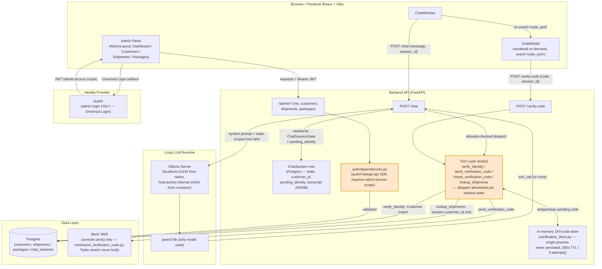

# 6.1 High-level system architecture

> Regenerated against the actual Week 1–4 implementation (Week 5). Corrected from the `REQUIREMENTS.md` starting reference: session state lives directly on the `ChatSession` Postgres row (no separate Redis/in-memory session store — the only in-memory store is the 2FA code, which is genuinely ephemeral and never persisted); the tool layer's enforcement point is the state-scoped allowlist in `routes/chat.py`'s `_tools_for_state()`/`_dispatch_tool()`; the LLM is `qwen3:8b` only (the "or Llama 3.2 3B" fallback was never built); transport is HTTP request/response only (the `REQUIREMENTS.md` WebSocket variant, §6.3b, was never implemented — locked out by `DEV_PLAN.md`); admin auth validates a real `admin:access` RBAC scope, not just a signed token.

**Corrections from the original reference, explicitly:**
- No dedicated "Session Store" component — `ChatSession` (Postgres) *is* the live session state; there's no in-memory/Redis mirror of it. The only genuinely in-memory, non-persisted store is the 2FA code (`services/verification_store.py`), which is a separate, smaller thing than "session state."
- The tool layer isn't a single generic gate — it's a per-state allowlist (`_tools_for_state()`) plus a name-check on every dispatched call (`_dispatch_tool()`), rejecting anything not offered for the session's current state (hardens against a hallucinated/prompt-injected tool name).
- Admin auth requires the `admin:access` RBAC permission as an OAuth scope, not just a validly-signed token (closed in Week 4, Chunk E — see `CLAUDE.md`).
- No WebSocket path exists anywhere in this build.
