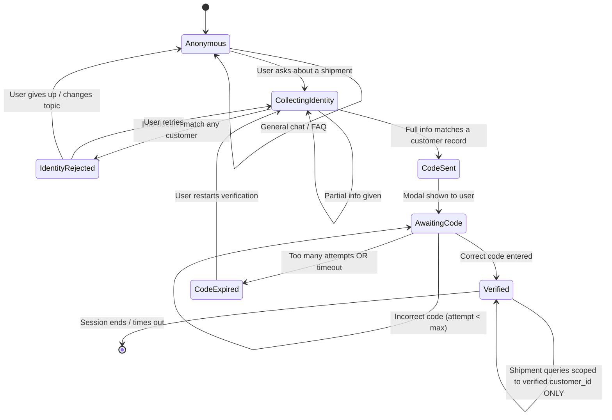

# 6.2 Conversation / identity-gating state machine

> Starting reference copied from `REQUIREMENTS.md` §6.2. This is the most important diagram in the program — it's the actual contract the backend must enforce. To be regenerated against the actual implementation in Week 5.

