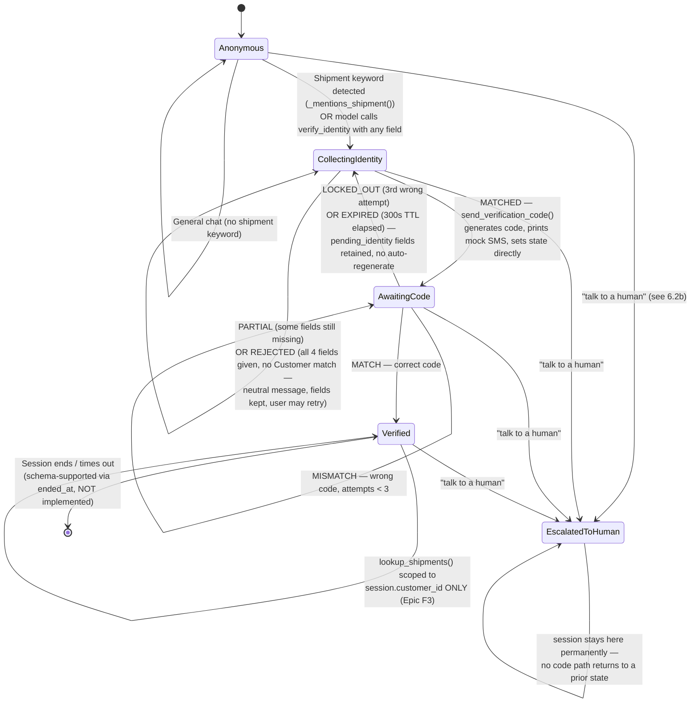

# 6.2 Conversation / identity-gating state machine

> Regenerated against the actual implementation (Week 5). This is the real contract `models/chat_session.py::ChatSessionState` + `routes/chat.py` enforce, not the aspirational version. Corrected from the `REQUIREMENTS.md` starting reference: there is no persisted `IdentityRejected` or `CodeExpired` state — a rejection or a lockout/expiry both land back on `CollectingIdentity` (identity fields retained via `pending_identity`), not a dedicated intermediate state. `CodeSent` exists as an enum value (`ChatSessionState.CODE_SENT`) but is never actually assigned — `send_verification_code()` sets `AwaitingCode` directly, collapsing the conceptual `CodeSent` step into one call. `EscalatedToHuman` is real (see `6.2b`) and reachable from *any* state, not just `Anonymous`/`Verified`. "Session ends / times out" is schema-supported (`ChatSession.ended_at`) but not implemented — nothing in this codebase ever sets it.

```mermaid
stateDiagram-v2
    [*] --> Anonymous

    Anonymous --> Anonymous: General chat (no shipment keyword)
    Anonymous --> CollectingIdentity: Shipment keyword detected (_mentions_shipment())<br/>OR model calls verify_identity with any field

    CollectingIdentity --> CollectingIdentity: PARTIAL (some fields still missing)<br/>OR REJECTED (all 4 fields given, no Customer match —<br/>neutral message, fields kept, user may retry)
    CollectingIdentity --> AwaitingCode: MATCHED — send_verification_code()<br/>generates code, prints mock SMS, sets state directly

    AwaitingCode --> Verified: MATCH — correct code
    AwaitingCode --> AwaitingCode: MISMATCH — wrong code, attempts < 3
    AwaitingCode --> CollectingIdentity: LOCKED_OUT (3rd wrong attempt)<br/>OR EXPIRED (300s TTL elapsed) —<br/>pending_identity fields retained, no auto-regenerate

    Verified --> Verified: lookup_shipments() scoped to<br/>session.customer_id ONLY (Epic F3)

    Anonymous --> EscalatedToHuman: "talk to a human" (see 6.2b)
    CollectingIdentity --> EscalatedToHuman: "talk to a human"
    AwaitingCode --> EscalatedToHuman: "talk to a human"
    Verified --> EscalatedToHuman: "talk to a human"
    EscalatedToHuman --> EscalatedToHuman: session stays here permanently —<br/>no code path returns to a prior state

    Verified --> [*]: Session ends / times out<br/>(schema-supported via ended_at, NOT implemented)
```

**Corrections from the original reference, explicitly:**
- `IdentityRejected` and `CodeExpired` are not real states — both a rejected identity match and a code lockout/expiry resolve back to `CollectingIdentity`, distinguished only by the `event`/`reply` text on that turn (`event="identity_rejected"`, or a locked-out/expired message from `/verify-code`), not by a separate node in the state machine.
- `CodeSent` is a dead enum value — checked the code path (`tools/send_verification_code.py`) and it sets `AwaitingCode` directly, never `CODE_SENT`. Kept as a code comment ("conceptually passes through CodeSent") but never actually assigned.
- Escalation (`EscalatedToHuman`) is reachable from every state except an already-escalated one — `routes/chat.py` checks `session.state != ChatSessionState.ESCALATED_TO_HUMAN`, not a specific-state allowlist. Once entered, there's no transition back out (see `6.2b`'s note on this) — the original reference's implication that escalation is a detour that returns to normal gating is incorrect.
- "Session ends / times out" has no implementation anywhere — `ChatSession.ended_at` is a real nullable column, but no code path ever sets it. Kept in the diagram as documented-but-not-built, not removed, since the schema already supports it.
