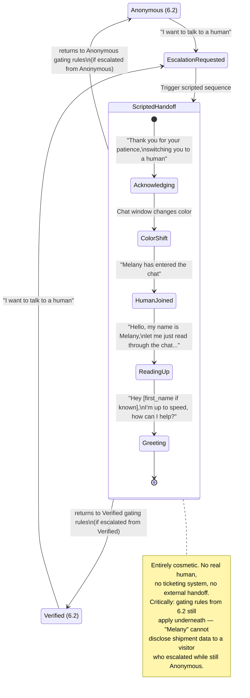

# 6.2b Human escalation sequence (Epic G — cosmetic, scripted)

> Starting reference copied from `REQUIREMENTS.md` §6.2b. Kept as its own small diagram rather than folded into 6.2, since it's a UI/UX theater layer that can trigger *from* either of the two main states (Anonymous or Verified) without actually changing the underlying gating logic. To be regenerated against the actual implementation in Week 5.

