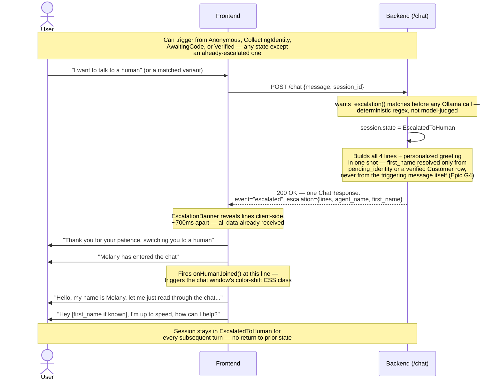
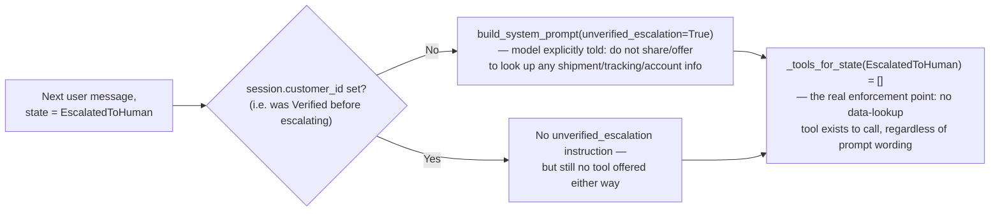

# 6.2b Human escalation sequence (Epic G — cosmetic, scripted)

> Regenerated against the actual implementation (Week 5). Corrected from the `REQUIREMENTS.md` starting reference: escalation triggers from **any** non-escalated state (`services/escalation.py::wants_escalation()`, a regex over several phrasings — not just the literal "I want to talk to a human"), not only `Anonymous`/`Verified`. The entire scripted sequence is built and returned in **one** backend response (`routes/chat.py::_handle_escalation()`) — there's no multi-turn backend exchange; the staggered reveal is a purely client-side pacing effect (`EscalationBanner.tsx`, ~700ms per line) over data that already arrived in full. The "chat window changes color" beat isn't a separate scripted line — it's a frontend side effect fired when the "Melany has entered the chat" line becomes visible. Critically, the session does **not** return to its prior gating state afterward — `EscalatedToHuman` is sticky for the rest of that session.

```mermaid
sequenceDiagram
    actor User
    participant FE as Frontend
    participant BE as Backend (/chat)

    Note over User,BE: Can trigger from Anonymous, CollectingIdentity,<br/>AwaitingCode, or Verified — any state except<br/>an already-escalated one

    User->>FE: "I want to talk to a human" (or a matched variant)
    FE->>BE: POST /chat {message, session_id}
    Note over BE: wants_escalation() matches before any Ollama call —<br/>deterministic regex, not model-judged
    BE->>BE: session.state = EscalatedToHuman
    Note over BE: Builds all 4 lines + personalized greeting<br/>in one shot — first_name resolved only from<br/>pending_identity or a verified Customer row,<br/>never from the triggering message itself (Epic G4)
    BE-->>FE: 200 OK — one ChatResponse:<br/>event="escalated", escalation={lines, agent_name, first_name}

    Note over FE: EscalationBanner reveals lines client-side,<br/>~700ms apart — all data already received
    FE->>User: "Thank you for your patience, switching you to a human"
    FE->>User: "Melany has entered the chat"
    Note over FE: Fires onHumanJoined() at this line —<br/>triggers the chat window's color-shift CSS class
    FE->>User: "Hello, my name is Melany, let me just read through the chat..."
    FE->>User: "Hey [first_name if known], I'm up to speed, how can I help?"

    Note over User,BE: Session stays in EscalatedToHuman for<br/>every subsequent turn — no return to prior state
```

**Gating still applies underneath, per turn:**

```mermaid
flowchart LR
    A["Next user message,<br/>state = EscalatedToHuman"] --> B{"session.customer_id set?<br/>(i.e. was Verified before escalating)"}
    B -->|No| C["build_system_prompt(unverified_escalation=True)<br/>— model explicitly told: do not share/offer<br/>to look up any shipment/tracking/account info"]
    B -->|Yes| D["No unverified_escalation instruction —<br/>but still no tool offered either way"]
    C --> E["_tools_for_state(EscalatedToHuman) = []<br/>— the real enforcement point: no data-lookup<br/>tool exists to call, regardless of prompt wording"]
    D --> E
```

**Corrections from the original reference, explicitly:**
- Escalation isn't scoped to `Anonymous`/`Verified` only — the real check (`session.state != ChatSessionState.ESCALATED_TO_HUMAN`) allows it from `CollectingIdentity` and `AwaitingCode` too.
- `ScriptedHandoff --> Anon` / `--> Ver` (returning to prior gating) never happens — `EscalatedToHuman` is a one-way, sticky state for the remainder of that session. Gating is enforced *within* `EscalatedToHuman` itself (no tool ever offered there; an explicit unverified-still-gated prompt instruction when `customer_id` is unset), not by leaving the state.
- The "color shift" isn't a distinct scripted step between "Acknowledging" and "Melany has entered the chat" — it's a frontend callback (`onHumanJoined`) fired *at* the "Melany has entered the chat" line's reveal, implemented as a CSS class toggle on the whole chat window (`chat-window--human-joined`).
- All 4 lines (3 scripted + 1 personalized greeting) are returned in a single backend response — the multi-step look is entirely a client-side reveal animation, not a real multi-turn exchange with the backend.
