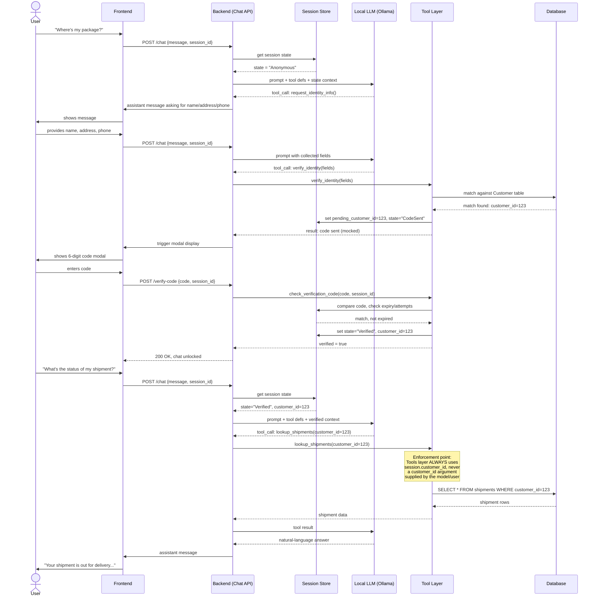

# 6.3 Tool-calling sequence (the gating enforcement point)

> Starting reference copied from `REQUIREMENTS.md` §6.3. This shows *why* enforcement must live in the backend tool layer, not the model's prompt. This repo's `DEV_PLAN.md` locks the chat transport to HTTP request/response (not WebSockets — §6.3b in REQUIREMENTS.md is the WebSocket variant and does not apply to this build). To be regenerated against the actual implementation in Week 5.

> **Typing note:** every payload below is a real REST request/response, so it's already fully covered by FastAPI's auto-generated OpenAPI schema — no extra work needed to get typed, codegen'd hooks on the frontend via Orval (Section 4.8).

