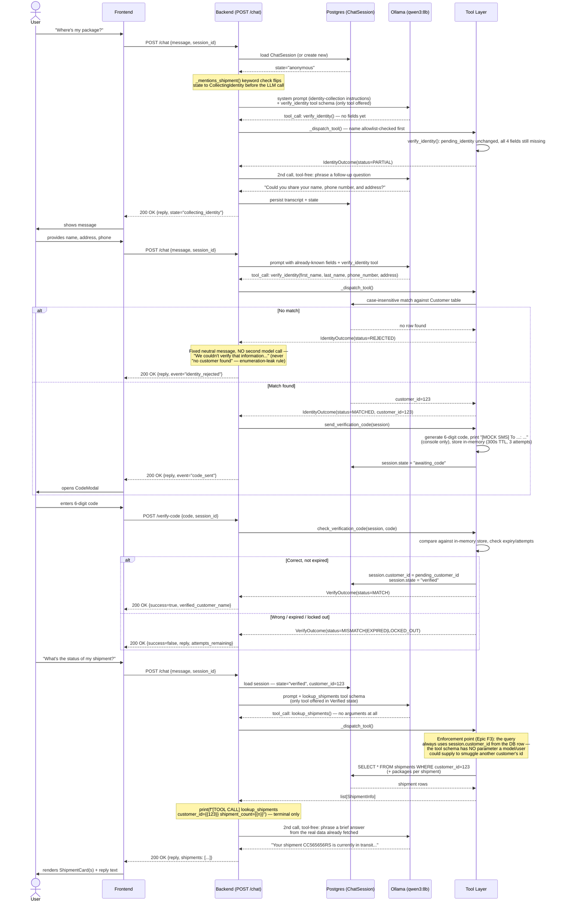

# 6.3 Tool-calling sequence (the gating enforcement point)

> Regenerated against the actual implementation (Week 5). Corrected from the `REQUIREMENTS.md` starting reference: there is no `request_identity_info()` tool — the model calls `verify_identity` directly, even with zero fields known yet, on the very first shipment-related turn. There's no separate "Session Store" participant — session state is read/written straight from the `ChatSession` Postgres row on every call. A rejected identity match returns a fixed neutral message with **no** second model call (not shown as a branch in the original). A `PARTIAL` match makes a second, tool-free model call to phrase a natural follow-up question — the same two-call pattern `lookup_shipments` uses to phrase its answer. This build is HTTP request/response only (locked per `DEV_PLAN.md` — the `REQUIREMENTS.md` §6.3b WebSocket variant was never built).

```mermaid
sequenceDiagram
    actor User
    participant FE as Frontend
    participant BE as Backend (POST /chat)
    participant DB as Postgres (ChatSession)
    participant LLM as Ollama (qwen3:8b)
    participant Tools as Tool Layer

    User->>FE: "Where's my package?"
    FE->>BE: POST /chat {message, session_id}
    BE->>DB: load ChatSession (or create new)
    DB-->>BE: state="anonymous"
    Note over BE: _mentions_shipment() keyword check flips<br/>state to CollectingIdentity before the LLM call
    BE->>LLM: system prompt (identity-collection instructions)<br/>+ verify_identity tool schema (only tool offered)
    LLM-->>BE: tool_call: verify_identity() — no fields yet
    BE->>Tools: _dispatch_tool() — name allowlist-checked first
    Tools->>Tools: verify_identity(): pending_identity unchanged, all 4 fields still missing
    Tools-->>BE: IdentityOutcome(status=PARTIAL)
    BE->>LLM: 2nd call, tool-free: phrase a follow-up question
    LLM-->>BE: "Could you share your name, phone number, and address?"
    BE->>DB: persist transcript + state
    BE-->>FE: 200 OK {reply, state="collecting_identity"}
    FE->>User: shows message

    User->>FE: provides name, address, phone
    FE->>BE: POST /chat {message, session_id}
    BE->>LLM: prompt with already-known fields + verify_identity tool
    LLM-->>BE: tool_call: verify_identity(first_name, last_name, phone_number, address)
    BE->>Tools: _dispatch_tool()
    Tools->>DB: case-insensitive match against Customer table
    alt No match
        DB-->>Tools: no row found
        Tools-->>BE: IdentityOutcome(status=REJECTED)
        Note over BE: Fixed neutral message, NO second model call —<br/>"We couldn't verify that information..." (never<br/>"no customer found" — enumeration-leak rule)
        BE-->>FE: 200 OK {reply, event="identity_rejected"}
    else Match found
        DB-->>Tools: customer_id=123
        Tools-->>BE: IdentityOutcome(status=MATCHED, customer_id=123)
        BE->>Tools: send_verification_code(session)
        Tools->>Tools: generate 6-digit code, print "[MOCK SMS] To ...: ..."<br/>(console only), store in-memory (300s TTL, 3 attempts)
        Tools->>DB: session.state = "awaiting_code"
        BE-->>FE: 200 OK {reply, event="code_sent"}
        FE->>User: opens CodeModal
    end

    User->>FE: enters 6-digit code
    FE->>BE: POST /verify-code {code, session_id}
    BE->>Tools: check_verification_code(session, code)
    Tools->>Tools: compare against in-memory store, check expiry/attempts
    alt Correct, not expired
        Tools->>DB: session.customer_id = pending_customer_id<br/>session.state = "verified"
        Tools-->>BE: VerifyOutcome(status=MATCH)
        BE-->>FE: 200 OK {success=true, verified_customer_name}
    else Wrong / expired / locked out
        Tools-->>BE: VerifyOutcome(status=MISMATCH|EXPIRED|LOCKED_OUT)
        BE-->>FE: 200 OK {success=false, reply, attempts_remaining}
    end

    User->>FE: "What's the status of my shipment?"
    FE->>BE: POST /chat {message, session_id}
    BE->>DB: load session — state="verified", customer_id=123
    BE->>LLM: prompt + lookup_shipments tool schema<br/>(only tool offered in Verified state)
    LLM-->>BE: tool_call: lookup_shipments() — no arguments at all
    BE->>Tools: _dispatch_tool()
    Note over Tools: Enforcement point (Epic F3): the query<br/>always uses session.customer_id from the DB row —<br/>the tool schema has NO parameter a model/user<br/>could supply to smuggle another customer's id
    Tools->>DB: SELECT * FROM shipments WHERE customer_id=123<br/>(+ packages per shipment)
    DB-->>Tools: shipment rows
    Tools-->>BE: list[ShipmentInfo]
    Note over BE: print(f"[TOOL CALL] lookup_shipments<br/>customer_id={{123}} shipment_count={{n}}") — terminal only
    BE->>LLM: 2nd call, tool-free: phrase a brief answer<br/>from the real data already fetched
    LLM-->>BE: "Your shipment CC565656RS is currently in transit..."
    BE-->>FE: 200 OK {reply, shipments: [...]}
    FE->>User: renders ShipmentCard(s) + reply text
```

**Corrections from the original reference, explicitly:**
- No `request_identity_info()` tool exists anywhere in the code — the model is offered `verify_identity` from the very first shipment-mentioning turn and can call it with zero fields known.
- A `REJECTED` identity outcome short-circuits to a fixed message string with no second LLM call — the original diagram implied every branch goes back through the model, which isn't how `routes/chat.py` is written.
- `PARTIAL` and a successful `lookup_shipments` call both use the same two-call shape: one call that triggers/executes the tool, a second tool-free call that phrases the reply from the real result — worth showing explicitly since it's the same pattern reused, not two different mechanisms.
- There is no separate "Session Store" component to read/write — the `ChatSession` Postgres row *is* the session state, loaded and committed directly in `routes/chat.py`.
- The only in-memory (non-Postgres) state is the 2FA code itself (`services/verification_store.py`), which this diagram now shows scoped to the tool layer, not conflated with general session state.
