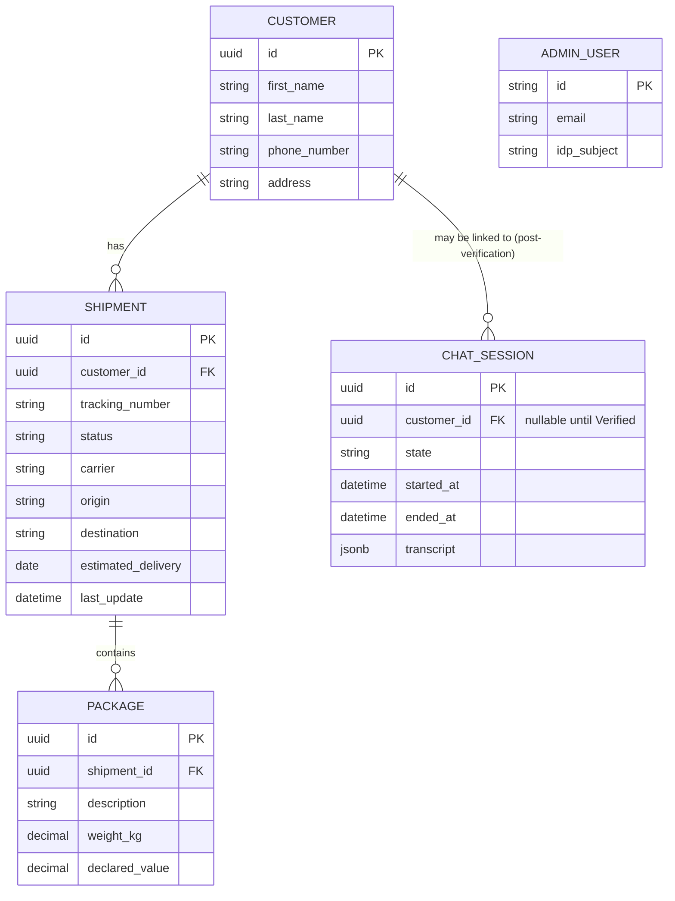

# 6.4 Data model (ERD)

> Starting reference copied from `REQUIREMENTS.md` §6.4. To be regenerated against the actual implementation in Week 5.

> Note: `ADMIN_USER` identity actually lives in Auth0; this row in the local DB (if mirrored) is just a reference/audit record, not the source of truth for credentials. `CHAT_SESSION.transcript` is the Postgres JSONB column described in Section 4.6.
