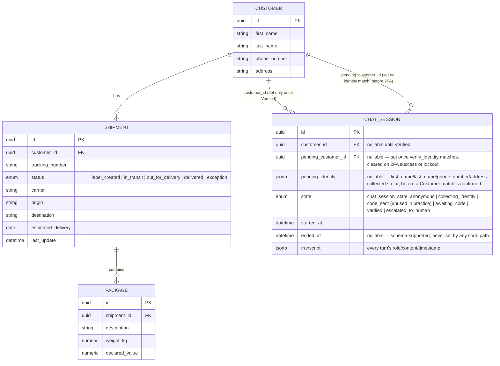

# 6.4 Data model (ERD)

> Regenerated against the actual SQLAlchemy models (Week 5) — `backend/models/customer.py`, `shipment.py`, `package.py`, `chat_session.py`. Corrected from the `REQUIREMENTS.md` starting reference: `CHAT_SESSION` has two more real columns than shown (`pending_customer_id`, `pending_identity` — scratch space for identity collected mid-conversation, added by a second Alembic migration in Week 2), `state` is a real Postgres enum (`chat_session_state`) with 6 values, and there is **no `ADMIN_USER` table in this database at all** — the original reference's note that it might be "a mirrored reference/audit record" never happened; admin identity lives exclusively in Auth0, and nothing in this codebase writes an admin row to Postgres.

```mermaid
erDiagram
    CUSTOMER ||--o{ SHIPMENT : has
    SHIPMENT ||--o{ PACKAGE : contains
    CUSTOMER ||--o{ CHAT_SESSION : "customer_id (set only once Verified)"
    CUSTOMER ||--o{ CHAT_SESSION : "pending_customer_id (set on identity match, before 2FA)"
    CUSTOMER {
        uuid id PK
        string first_name
        string last_name
        string phone_number
        string address
    }
    SHIPMENT {
        uuid id PK
        uuid customer_id FK
        string tracking_number
        enum status "label_created | in_transit | out_for_delivery | delivered | exception"
        string carrier
        string origin
        string destination
        date estimated_delivery
        datetime last_update
    }
    PACKAGE {
        uuid id PK
        uuid shipment_id FK
        string description
        numeric weight_kg
        numeric declared_value
    }
    CHAT_SESSION {
        uuid id PK
        uuid customer_id FK "nullable until Verified"
        uuid pending_customer_id FK "nullable — set once verify_identity matches,<br/>cleared on 2FA success or lockout"
        jsonb pending_identity "nullable — first_name/last_name/phone_number/address<br/>collected so far, before a Customer match is confirmed"
        enum state "chat_session_state: anonymous | collecting_identity |<br/>code_sent (unused in practice) | awaiting_code |<br/>verified | escalated_to_human"
        datetime started_at
        datetime ended_at "nullable — schema-supported, never set by any code path"
        jsonb transcript "every turn's role/content/timestamp"
    }
```

> **Admin identity note:** there is no `ADMIN_USER` table. Admin identity/credentials live entirely in Auth0; the backend only ever validates a bearer JWT (`auth/dependencies.py`) and reads its claims (`sub`, `email`) at request time via `GET /admin/me` — nothing about an admin user is ever written to this Postgres database. This is a deliberate structural-separation point (Epic E4): no code path lets an admin identity and a `ChatSession`/`Customer` row cross over, in either direction — enforced and proven by `backend/tests/test_admin_chat_separation.py`.
>
> `CHAT_SESSION.transcript` is the Postgres `JSONB` column described in Section 4.6 — a list of `{role, content, timestamp}` objects appended to on every `/chat` turn.
