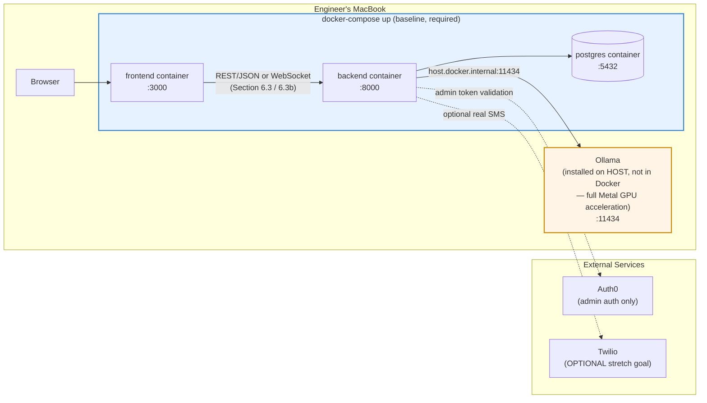
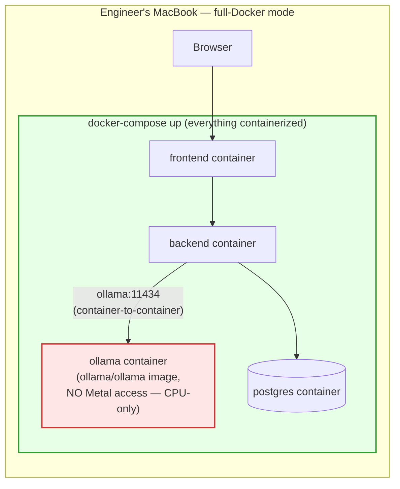

# 6.5 Deployment / local dev topology

> Starting reference copied from `REQUIREMENTS.md` §6.5. Note: the original diagram is Mac-oriented ("Engineer's MacBook"); this build runs on Windows — per `DEV_PLAN.md`'s note, `host.docker.internal:11434` resolves identically on Docker Desktop for Windows, so the topology itself doesn't change, only the host OS label needs correcting when this diagram is regenerated in Week 5.

**Bonus tier — Ollama containerized too (optional, harder mode, scheduled as a Week 5 stretch goal in this build's `DEV_PLAN.md`):**

> On this build's machine there's no dedicated GPU either way (CPU-only whether Ollama runs on host or in a container), so containerizing Ollama here is a pure Docker-wiring exercise, not the "genuinely slower" performance trade-off the original Mac-oriented note describes.
