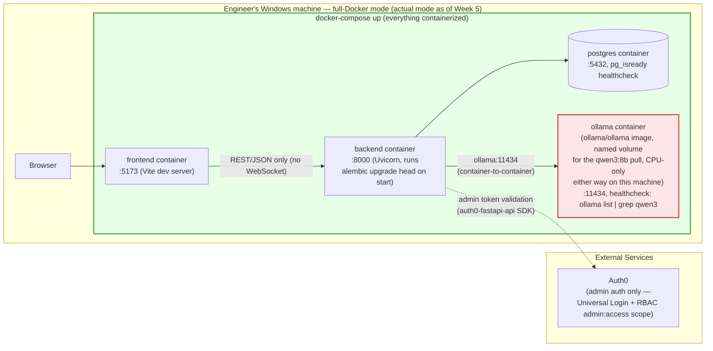
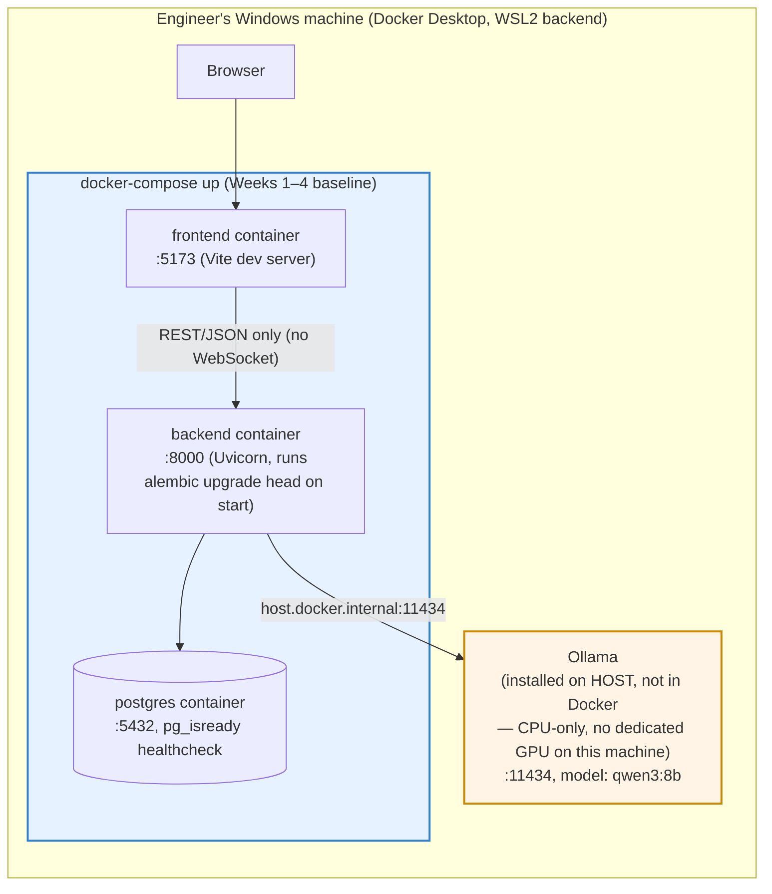

# 6.5 Deployment / local dev topology

> Regenerated against the actual `docker-compose.yml` (Week 5, post-stretch-goal). Corrected from the `REQUIREMENTS.md` Mac-oriented starting reference: this build runs on Windows (Docker Desktop, WSL2 backend) — the "full Metal acceleration" framing doesn't apply either way, since this machine has no dedicated GPU (Ollama is CPU-only whether host-native or containerized — that's *why* containerizing it was a low-risk Week 5 stretch goal here rather than the genuine performance trade-off the Mac doc describes). Frontend serves on **`:5173`** (Vite dev server), not `:3000`. Twilio was never built — it stayed a documented "optional stretch" that was never picked up; shown here only as explicitly not implemented, not as a live integration point.

```mermaid
flowchart LR
    subgraph DevMachine["Engineer's Windows machine — full-Docker mode (actual mode as of Week 5)"]
        direction TB
        subgraph Compose["docker-compose up (everything containerized)"]
            direction TB
            ReactC2["frontend container<br/>:5173 (Vite dev server)"]
            PyC2["backend container<br/>:8000 (Uvicorn, runs<br/>alembic upgrade head on start)"]
            PgC2[("postgres container<br/>:5432, pg_isready healthcheck")]
            OllamaC["ollama container<br/>(ollama/ollama image, named volume<br/>for the qwen3:8b pull, CPU-only<br/>either way on this machine)<br/>:11434, healthcheck: ollama list | grep qwen3"]
        end
        Browser2[Browser]
    end

    subgraph Cloud["External Services"]
        AuthProvider["Auth0<br/>(admin auth only —<br/>Universal Login + RBAC admin:access scope)"]
    end

    Browser2 --> ReactC2
    ReactC2 -->|"REST/JSON only (no WebSocket)"| PyC2
    PyC2 -->|"ollama:11434<br/>(container-to-container)"| OllamaC
    PyC2 --> PgC2
    PyC2 -.->|"admin token validation<br/>(auth0-fastapi-api SDK)"| AuthProvider

    style Compose fill:#e6ffe6,stroke:#339933,stroke-width:2px
    style OllamaC fill:#ffe6e6,stroke:#cc3333,stroke-width:2px
```

**Previous tier — Ollama host-native (Weeks 1–4 mode, still supported for backend-outside-Docker iteration):**

```mermaid
flowchart LR
    subgraph DevMachine["Engineer's Windows machine (Docker Desktop, WSL2 backend)"]
        direction TB

        subgraph Compose["docker-compose up (Weeks 1–4 baseline)"]
            direction TB
            ReactC["frontend container<br/>:5173 (Vite dev server)"]
            PyC["backend container<br/>:8000 (Uvicorn, runs<br/>alembic upgrade head on start)"]
            PgC[("postgres container<br/>:5432, pg_isready healthcheck")]
        end

        Browser[Browser]
        OllamaHost["Ollama<br/>(installed on HOST, not in Docker<br/>— CPU-only, no dedicated GPU on this machine)<br/>:11434, model: qwen3:8b"]
    end

    Browser --> ReactC
    ReactC -->|"REST/JSON only (no WebSocket)"| PyC
    PyC -->|"host.docker.internal:11434"| OllamaHost
    PyC --> PgC

    style Compose fill:#e6f2ff,stroke:#3380cc,stroke-width:2px
    style OllamaHost fill:#fff4e6,stroke:#cc8800,stroke-width:2px
```

> No performance trade-off either way on this machine (CPU-only, no GPU to lose by containerizing) — so moving Ollama into Compose was a pure Docker-wiring exercise. Twilio (real SMS) was never built anywhere in this repo; the mock-SMS path (`tools/send_verification_code.py`, console `print()` only) is the only implementation that exists, and is not shown in this diagram as a live external dependency.
